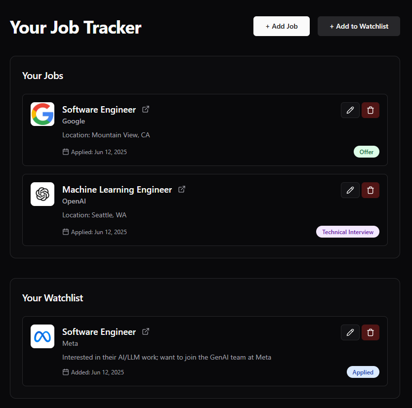

# 🗂️ Trackie  

[](https://opensource.org/licenses/MIT) [](https://spring.io/projects/spring-boot) [](https://nextjs.org/) [](https://www.postgresql.org/) [](https://tailwindcss.com/)

---

## 📖 About the Project  

**Trackie** is a full-stack job application tracker that helps you stay on top of every application, interview, and deadline
Forget messy spreadsheets, Trackie gives you an organized dashboard to track statuses, set reminders, and even parse resumes automatically

Built for job seekers who want to manage their career search efficiently

---

## ✨ Key Features  

### Core Features (MVP)  
- 📝 **Application Tracking**: Add, edit, and delete job applications  
- 📊 **Sorting & Filtering**: Organize by company, status, role, or deadline  
- ⏰ **Reminders**: Get notified about interviews & upcoming deadlines  
- 🔒 **User-Specific Data**: Each user’s applications are private & secure
- 📑 **Resume Parsing** (AWS Textract) – Auto-extract job details from resumes
- 📂 **File Storage** (AWS S3) – Upload & manage resumes  

### Planned Features  
- 📬 **Email Reminders** (AWS SES) – Interview & deadline notifications  
- 📂 **File Storage** (AWS S3) – Upload & manage resumes  
- 📈 **Analytics Dashboard** – Visualize offers, rejections, and progress  

---

## 🛠️ Tech Stack  

### Frontend  
- **Next.js**  
- **TailwindCSS**  

### Backend  
- **Spring Boot** (Java)  
- **PostgreSQL**
- **FastAPI**

### Authentication  
- **Google Sign-In (OAuth2)**

### NLP
- **spaCy**
- **FastAPI**

### Cloud
- **AWS S3**
- **AWS Textract**

---

## 🔄 Feature Flow Example: Application Lifecycle  

1. Log a new application with role, company, and deadline
2. Upload a job posting as easy as providing a screenshot
3. Update the status as you move from *Applied → Interview → Offer*
4. Track upcoming interviews with reminders.
5. Review your overall job search progress in one dashboard with a clean UI

---

## 🏠 Dashboard Preview  

<p align="center">
  
</p>

---

## 🚀 How to Run (Dev)  

### Prerequisites  
- Node.js + npm  
- Java 17+  
- PostgreSQL
- Python3

### Setup  
```bash
# ==== Clone repo ====
git clone https://github.com/your-username/trackie.git
cd trackie

# ──────────────────────────────────────────────────────────────────────────────
# 1) Databases (PostgreSQL)
# ──────────────────────────────────────────────────────────────────────────────
# ──────────────────────────────────────────────────────────────────────────────
# 2) Backend (Spring Boot) - REST API for core CRUD
# ──────────────────────────────────────────────────────────────────────────────
cd backend
# Run Spring Boot
./mvnw spring-boot:run


# ──────────────────────────────────────────────────────────────────────────────
# 3) Resume Parsing / Utility Service (FastAPI) - microservice e.g., Textract, NLP
# ──────────────────────────────────────────────────────────────────────────────
# Open a NEW terminal in project root:
cd trackie/ai
python -m venv .venv
source .venv/bin/activate  # Windows: .venv\Scripts\activate
pip install -r requirements.txt
uvicorn app.main:app 

# ──────────────────────────────────────────────────────────────────────────────
# 4) Frontend (Next.js)
# ──────────────────────────────────────────────────────────────────────────────
cd trackie/frontend
npm install
npm run dev

# ──────────────────────────────────────────────────────────────────────────────
# 5) AWS setup (for Textract / S3 / SES)
# ──────────────────────────────────────────────────────────────────────────────
# You’ll need AWS creds available to FastAPI (and/or Spring Boot if you use AWS SDK there)

# Example (macOS/Linux):
export AWS_ACCESS_KEY_ID=YOUR_KEY_ID
export AWS_SECRET_ACCESS_KEY=YOUR_SECRET
export AWS_DEFAULT_REGION=us-east-1

